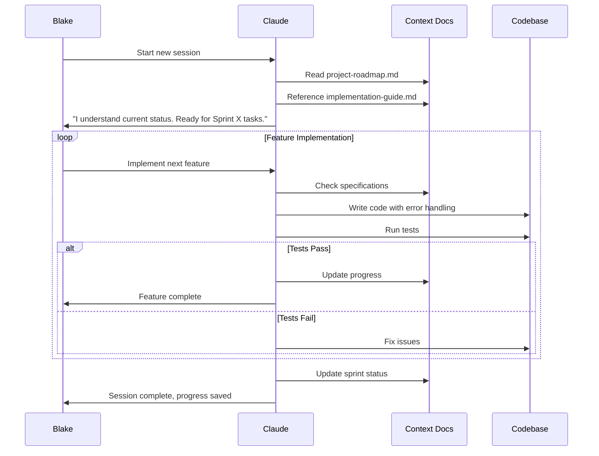

## Context Engineering: From Vibe Coder to AI Orchestrator

In my previous post about **"[AI Coding: From Vibe Coding to Professional](https://dev.to/phucnt/from-vibe-coding-to-professional-ai-powered-development-a-practical-handbook-mlp)"**, I mentioned **Context Management** as Best Practice #6 in the journey to become an AI Orchestrator. But that was just the overview – a high-level view of the importance of context management.

Today's post will dive deep into this topic. I'll share a **specific, immediately applicable framework** so you can truly master Context Engineering – the art of building a "collective brain" for AI.

Context Engineering isn't just about providing information to AI. It's a systematic approach to building an environment where AI always receives the right information, at the right time, to complete tasks most effectively. Imagine: instead of having to "brief" AI from scratch each time, you create a system where AI automatically knows what to do, following which process, and to what standards.

This is precisely the difference between "going with the flow with AI" and "orchestrating AI" – between Vibe Coder and AI Orchestrator.

This framework isn't a silver bullet for every type of project, but it's been tested by me on several **"[weekend projects](https://github.com/search?q=owner%3Aphuc-nt+mcp&type=repositories)"**, so I can confidently say it will help with small projects (under 20MD if done by humans), and test environments simple enough for Agents to automate with test suites.

So, if you share similar interests with me, let's continue.

## Vibe Coding and Context Engineering

One of my weekend projects was building an MCP server for Confluence Data Center with 11 tools. A project small enough to test AI coding capabilities.

#### When still "Vibe Coding"

I jumped straight in with the "wing it" style. Opened Claude and started:

> **Me:** "Hey Claude, I need to build an MCP server for Confluence DC, with 11 tools."
>
> **Claude:** "Great! Could you tell me specifically what those 11 tools are?"
>
> **Me:** "Ah... there's createPage, getPage... umm... let me remember..."

The price paid was steep: 5 days passed, only 4/11 tools completed, codebase full of "technical debt", and every day I spent hours just "briefing" AI. Stress skyrocketed, confidence hit rock bottom.

#### Slowing down with "Context Engineering"

Disappointed but not giving up, I decided to try again. This time, instead of rushing to code, I spent the first 2 hours **building a "brain" for AI** through a documentation system:

```
docs/
├── 00_context/              # AI's Long-term Memory
│   ├── requirements.md      # Business goals, success criteria
│   ├── implementation-guide.md  # Technical architecture, patterns
│   └── reference.md         # Additional references
├── 01_plan/                 # Project Management  
│   └── project-roadmap.md   # Timeline, current status, sprints
└── 02_implement/           # Sprint Execution
    ├── sprint-1.md         # Detailed task breakdown
    ├── sprint-2.md         # Daily progress tracking
    └── sprint-3.md         # Acceptance criteria
```

And here's how my new session started:

> **Me:** "Hey, we're starting the MCP server project. First, please read all documentation in `docs/` to understand the context."
>
> **Claude:** "I've read and understand clearly. According to `project-roadmap.md`, we'll start with Sprint 1. Based on `implementation-guide.md`, I'll use the single API client model... Shall we begin?"

That's magic. In just 3 days, I not only completed 11/11 tools with production-ready quality but also published it as an npm package.

That magic is called **process** – something Vibe Coders often forget. Next is the complete content of the framework you can take and try immediately.

## 3 Steps to Context Engineering

Great that you haven't given up yet.

How to start now? It's simpler than you think. Here are 3 steps for you:

#### Step 1: Build AI's Long-term Memory

Don't do everything yourself! Let AI build context for itself.

1. **Create `requirements.md`**: Use a Reasoning AI to play Product Manager. Brainstorm with it to create detailed requirements. You can refer to the process I shared in the post [Optimizing Requirement Writing with AI](https://dev.to/phucnt/optimizing-requirement-writing-with-ai-from-vague-to-detailed-7bg).
2. **Complete remaining documents**: Once you have proper `requirements.md`, hand them to an Internet Search AI. It will quickly suggest architecture, coding patterns and create the remaining technical documents for you.

#### Step 2: Set up AI's Rules

This is when you give AI a "behavioral rulebook". Create a base rules file in your project (depending on the Agent you use, the file will be named `CLAUDE.md` or `clinerules.md`).

Inside this file, you'll define everything, from **Startup Workflow** (what AI must do when starting a session), **Task Lifecycle** (lifecycle of a task from start to completion), **Quality Gates** (conditions to be considered "done"), to **Documentation Rules**. This is the "handbook" that helps AI behave like a disciplined engineer instead of a confused intern.

**Visualize this rules set as the following process:**



**And here's the detailed content for you to copy paste, to put in `CLAUDE.md` or `clinerules.md`, depending on your Agent:**

```
### Startup Workflow (Each Session)

1. Check the project setup.
2. **Read `docs/01_plan/project-roadmap.md`** - To understand the project status and current focus.
3. **Reference context documents** - `requirements.md`, `implementation-guide.md` as needed.

### Task Management Process

Task Lifecycle:
  1. Identify task: From the current sprint or user request.
  2. Focus mode: Work on one task at a time, do not jump around.
  3. Implement feature: Code implementation with proper error handling.
  4. Test Suite Update: MANDATORY - Update the test suite for every new feature.
  5. Quality validation: All tests must PASS before marking a task as complete.
  6. Update progress: Update the sprint document only when ALL TESTS PASS.
  7. Commit clean: Use a clear commit message following conventions.
  8. Update status: Update the sprint document and `project_roadmap.md`.

Quality Gates:
  - Code compiles: The build must succeed.
  - Test Suite: All automated tests (connection + functional) must PASS.
  - No regressions: Existing functionality must not be broken.
  - No token leaks: Do not commit sensitive data.
  - Documentation: Update docs with test results.

Test Requirements:
  - Every new feature requires corresponding tests.
  - Tests must PASS before a sprint task can be completed.
  - The test suite must be maintained and updated consistently.

### Role of Document Groups

**`00_context/` - Technical Foundation (DO NOT EDIT WITHOUT EXPLICIT APPROVAL)**:
- `requirements.md`: Business requirements, project scope, success criteria.
- `implementation-guide.md`: Technical architecture, code patterns, API client structure.
- `confluence-tools-reference.md`: Complete tool-to-API endpoint mapping reference.

**`01_plan/` - Project Management**:
- `project-roadmap.md`: Project timeline, current status, sprint progress, next actions.

**`02_implement/` - Sprint Execution (UPDATED DAILY)**:
- `sprint-X-*.md`: Detailed task breakdown, acceptance criteria, daily progress tracking.

### Documentation Rules

Update Rules:
  project_roadmap.md: Update for major progress, phase completion, current status.
  sprint_*.md: Update for daily progress, task completion.
  00_context/: Never update without explicit approval (requirements, architecture, API specs).

Maintenance Principles:
  - AVOID DUPLICATION: Link instead of repeating information.
  - KEEP CONCISE: Overview docs stay short, details go in specific docs.
  - SINGLE SOURCE OF TRUTH: Each piece of information lives in one place.
  - CROSS-REFERENCE: Use links to connect related information.
  - STATUS FIRST: Always show the current status clearly.

Writing Style:
  - Concise and actionable.
  - Use status indicators: Not Started, In Progress, Completed, Blocked.
  - Include time estimates and actual time spent.
  - Link related documents instead of duplicating content.

  Document Flow: `project_roadmap.md` → `sprint_*.md` → specific details.
  Never put detailed task lists in overview documents.
```

#### Step 3: There is no Step 3

That's it, just ask the Agent:

**"You know what to do."**

And then, sit down, sip your coffee and watch the magic. AI will automatically read the roadmap, identify the next task, and start implementing according to the process you've established.

## Conclusion

And that's it. 3 simple steps (actually just 2), but the effectiveness is significant.

This framework isn't something divine that will solve all problems. It's only particularly effective for small projects with clear test suites, and when you have time to invest in initial context setup.

But when it works, it really works.

With various **"[weekend projects](https://github.com/search?q=owner%3Aphuc-nt+mcp&type=repositories)"**, the results I get are always consistent: AI no longer "gets lost", code quality is stable, and most importantly, I don't stress about losing control.

**This is precisely the difference between Vibe Coder and AI Orchestrator.**

Vibe Coder prompts and hopes. AI Orchestrator creates an ecosystem for AI to operate effectively.

If you've followed the journey from the previous post - from Vibe Coding to disciplined process - then Context Engineering is the final piece. It turns theoretical Best Practices into a concrete, repeatable workflow.

Now, you have enough tools to not just "go with the flow with AI" but truly "orchestrate AI".

Good luck with your next weekend project!