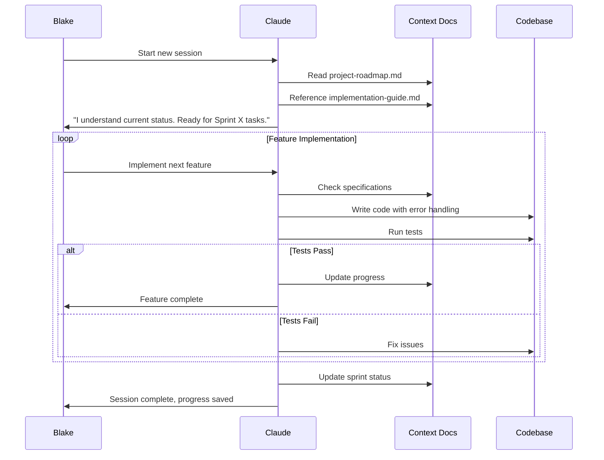

## Context Engineering

Trong bài viết trước về **"[AI Coding: Từ Vibe Coding đến Chuyên Nghiệp](https://phucnt.substack.com/p/ai-coding-tu-vibe-coding-en-chuyen)"**, tôi đã nhắc đến **Context Management** như Best Practice thứ 6 trong hành trình trở thành AI Orchestrator. Nhưng đó mới chỉ là phần khái quát – một cái nhìn tổng quan về tầm quan trọng của việc quản lý ngữ cảnh.

Bài viết hôm nay sẽ đi sâu vào chủ đề này. Tôi sẽ chia sẻ **framework cụ thể, có thể áp dụng ngay** để bạn thực sự làm chủ Context Engineering – nghệ thuật xây dựng "bộ não tập thể" cho AI.

Context Engineering không chỉ là việc cung cấp thông tin cho AI. Đó là phương pháp có hệ thống để xây dựng một môi trường nơi AI luôn nhận được đúng thông tin, vào đúng thời điểm, để hoàn thành tác vụ một cách hiệu quả nhất. Hãy hình dung: thay vì mỗi lần phải "nhắc bài" cho AI từ đầu, bạn tạo ra một hệ thống mà AI tự động biết phải làm gì, theo quy trình nào, và với tiêu chuẩn ra sao.

Đây chính là sự khác biệt giữa việc "thả trôi với AI" và "điều phối AI" – giữa Vibe Coder và AI Orchestrator.

Framework này không phải thứ toàn năng, áp dụng được cho mọi kiểu dự án, nhưng nó đã được tôi kiểm chứng với vài **"[dự án cuối tuần](https://github.com/search?q=owner%3Aphuc-nt+mcp&type=repositories)"**, nên tôi có thể tự tin, rằng nó sẽ giúp ích cho các dự án cỡ nhỏ (dưới 20MD nếu do con người làm), và môi trường test không quá phức tạp để Agent có thể tự động hoá với test suite.

Rồi, nếu bạn có chung mối quan tâm với tôi, thì chúng ta tiếp tục.

## Vibe Coding và Context Engineering

Một trong các dự án cuối tuần của tôi là xây dựng một MCP server cho Confluence Data Center với 11 công cụ. Một dự án đủ nhỏ để thử sức với AI coding.

#### Khi vẫn còn "Vibe Coding"

Tôi đã lao thẳng vào việc theo phong cách "tới đâu hay tới đó". Mở Claude lên và bắt đầu:

> **Tôi:** "Này Claude, tôi cần xây một cái MCP server cho Confluence DC, có 11 tools."
>
> **Claude:** "Tuyệt! Bạn có thể cho tôi biết cụ thể 11 tools đó là gì không?"
>
> **Tôi:** "À... thì có createPage, getPage... ừm... để tôi nhớ xem..."

Và cái giá phải trả thì thật đắt: 5 ngày trôi qua, chỉ 4/11 tools hoàn thành, codebase đầy "nợ kỹ thuật", và mỗi ngày tôi đều mất vài tiếng chỉ để "nhắc bài" cho AI. Stress tăng vọt, sự tự tin chạm đáy.

#### Chậm lại với "Context Engineering"

Thất vọng nhưng không bỏ cuộc, tôi quyết định thử lại. Lần này, thay vì vội vã code, tôi dành ra 2 giờ đầu tiên để **xây dựng một "bộ não" cho AI** thông qua hệ thống tài liệu:

```
docs/
├── 00_context/              # AI's Long-term Memory
│   ├── requirements.md      # Business goals, success criteria
│   ├── implementation-guide.md  # Technical architecture, patterns
│   └── reference.md         # Additional references
├── 01_plan/                 # Project Management  
│   └── project-roadmap.md   # Timeline, current status, sprints
└── 02_implement/           # Sprint Execution
    ├── sprint-1.md         # Detailed task breakdown
    ├── sprint-2.md         # Daily progress tracking
    └── sprint-3.md         # Acceptance criteria
```

Và đây là cách session mới của tôi bắt đầu:

> **Tôi:** "Chào mày, chúng ta sẽ bắt đầu dự án MCP server. Đầu tiên, hãy đọc toàn bộ tài liệu trong `docs/` để nắm bối cảnh."
>
> **Claude:** "Tôi đã đọc và hiểu rõ. Theo `project-roadmap.md`, chúng ta sẽ bắt đầu với Sprint 1. Dựa trên `implementation-guide.md`, tôi sẽ sử dụng mô hình single API client... Chúng ta bắt đầu chứ?"

Đó là phép màu. Chỉ sau 3 ngày, tôi không chỉ hoàn thành 11/11 tools với chất lượng production-ready mà còn xuất bản nó thành một npm package.

Phép màu đó gọi là **quy trình**, thứ mà Vibe Coder thường bỏ quên. Và tiếp theo là nội dung đầy đủ của framework mà bạn có thể đem về và thử ngay.

## 3 bước tới Context Engineering

Rất vui vì bạn chưa bỏ cuộc. 

Giờ bắt đầu thế nào? Nó đơn giản hơn bạn nghĩ. Đây là 3 bước dành cho bạn:

#### Bước 1: Xây dựng AI's Long-term Memory

Đừng tự mình làm hết! Hãy để AI xây dựng context cho chính nó.

1.  **Tạo `requirements.md`**: Sử dụng một AI chuyên về tư duy (Reasoning AI) để đóng vai Product Manager. Cùng nó brainstorming để tạo ra một bản yêu cầu chi tiết. Bạn có thể tham khảo quy trình tôi đã chia sẻ trong bài viết [Tối ưu việc viết Requirement với AI](https://phucnt.substack.com/p/toi-uu-viec-viet-requirement-voi).
2.  **Hoàn thiện các tài liệu còn lại**: Khi đã có `requirements.md` chuẩn, hãy giao chúng cho một AI có khả năng tìm kiếm web (Internet Search AI). Nó sẽ nhanh chóng đề xuất kiến trúc, coding patterns và tạo các tài liệu kỹ thuật còn lại cho bạn.

#### Bước 2: Thiết lập AI's Rules

Đây là lúc bạn đưa cho AI một "bộ quy tắc hành động". Hãy tạo một file quy tắc gốc trong dự án của bạn (tuỳ vào Agent bạn sử dụng, file sẽ có tên `CLAUDE.md` hay `clinerules.md`).

Bên trong file này, bạn sẽ định nghĩa mọi thứ, từ **Startup Workflow** (AI phải làm gì khi bắt đầu session), **Task Lifecycle** (vòng đời của một task từ lúc bắt đầu đến khi hoàn thành), **Quality Gates** (các điều kiện để được coi là "xong"), cho đến các **Documentation Rules**. Đây chính là "cuốn cẩm nang" giúp AI hành xử như một kỹ sư có kỷ luật thay vì một thực tập sinh ngơ ngác.

**Visualize bộ rules này sẽ là quy trình như sau:**



**Và đây là nội dung chi tiết cho bạn copy paste, để bỏ vào `CLAUDE.md`, hay `clinerules.md`, tuỳ Agent bạn dùng:**

```
### Startup Workflow (Each Session)

1. Check the project setup.
2. **Read `docs/01_plan/project-roadmap.md`** - To understand the project status and current focus.
3. **Reference context documents** - `requirements.md`, `implementation-guide.md` as needed.

### Task Management Process

Task Lifecycle:
  1. Identify task: From the current sprint or user request.
  2. Focus mode: Work on one task at a time, do not jump around.
  3. Implement feature: Code implementation with proper error handling.
  4. Test Suite Update: MANDATORY - Update the test suite for every new feature.
  5. Quality validation: All tests must PASS before marking a task as complete.
  6. Update progress: Update the sprint document only when ALL TESTS PASS.
  7. Commit clean: Use a clear commit message following conventions.
  8. Update status: Update the sprint document and `project_roadmap.md`.

Quality Gates:
  - Code compiles: The build must succeed.
  - Test Suite: All automated tests (connection + functional) must PASS.
  - No regressions: Existing functionality must not be broken.
  - No token leaks: Do not commit sensitive data.
  - Documentation: Update docs with test results.

Test Requirements:
  - Every new feature requires corresponding tests.
  - Tests must PASS before a sprint task can be completed.
  - The test suite must be maintained and updated consistently.

### Role of Document Groups

**`00_context/` - Technical Foundation (DO NOT EDIT WITHOUT EXPLICIT APPROVAL)**:
- `requirements.md`: Business requirements, project scope, success criteria.
- `implementation-guide.md`: Technical architecture, code patterns, API client structure.
- `confluence-tools-reference.md`: Complete tool-to-API endpoint mapping reference.

**`01_plan/` - Project Management**:
- `project-roadmap.md`: Project timeline, current status, sprint progress, next actions.

**`02_implement/` - Sprint Execution (UPDATED DAILY)**:
- `sprint-X-*.md`: Detailed task breakdown, acceptance criteria, daily progress tracking.

### Documentation Rules

Update Rules:
  project_roadmap.md: Update for major progress, phase completion, current status.
  sprint_*.md: Update for daily progress, task completion.
  00_context/: Never update without explicit approval (requirements, architecture, API specs).

Maintenance Principles:
  - AVOID DUPLICATION: Link instead of repeating information.
  - KEEP CONCISE: Overview docs stay short, details go in specific docs.
  - SINGLE SOURCE OF TRUTH: Each piece of information lives in one place.
  - CROSS-REFERENCE: Use links to connect related information.
  - STATUS FIRST: Always show the current status clearly.

Writing Style:
  - Concise and actionable.
  - Use status indicators: Not Started, In Progress, Completed, Blocked.
  - Include time estimates and actual time spent.
  - Link related documents instead of duplicating content.

  Document Flow: `project_roadmap.md` → `sprint_*.md` → specific details.
  Never put detailed task lists in overview documents.
```

#### Bước 3: Làm gì có bước 3

Đến đây thì xong rồi, hãy hỏi Agent rằng:

**"Bạn biết phải làm gì rồi đấy."**

Và rồi, hãy ngồi xuống, nhâm nhi ly cà phê và quan sát điều kỳ diệu. AI sẽ tự động đọc roadmap, xác định công việc tiếp theo, và bắt đầu implement theo đúng quy trình bạn đã đặt ra.

## Kết

Và thế là xong. 3 bước đơn giản (thực ra là 2 thôi), nhưng độ hiệu quả thì không hề nhỏ.

Framework này không phải là thứ thần thánh sẽ giải quyết mọi vấn đề. Nó chỉ đặc biệt hiệu quả cho các dự án nhỏ, có test suite rõ ràng, và bạn có thời gian đầu tư vào việc setup context ban đầu.

Nhưng khi nó work, thì nó thực sự work.

Với vài **"[dự án cuối tuần](https://github.com/search?q=owner%3Aphuc-nt+mcp&type=repositories)"** khác nhau, kết quả tôi nhân được luôn ổn định: AI không còn "lạc đường", code quality ổn định, và quan trọng nhất, tôi không phải stress vì mất kiểm soát.

**Đây chính là sự khác biệt giữa Vibe Coder và AI Orchestrator.**

Vibe Coder thì prompt rồi hy vọng. AI Orchestrator thì tạo ra một hệ sinh thái để AI hoạt động hiệu quả.

Nếu bạn đã theo hành trình từ bài viết trước - từ Vibe Coding đến quy trình có kỷ luật - thì Context Engineering chính là mảnh ghép cuối cùng. Nó biến những Best Practices lý thuyết thành một workflow cụ thể, có thể lặp lại.

Giờ đây, bạn đã có đủ công cụ để không chỉ "thả trôi với AI" mà thực sự "điều phối AI" (orchestrate AI).

Chúc bạn thành công với dự án cuối tuần tiếp theo!