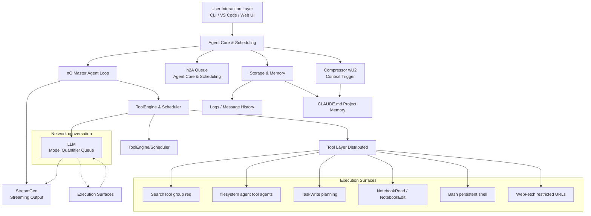
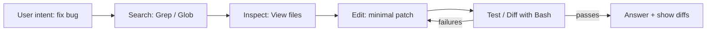
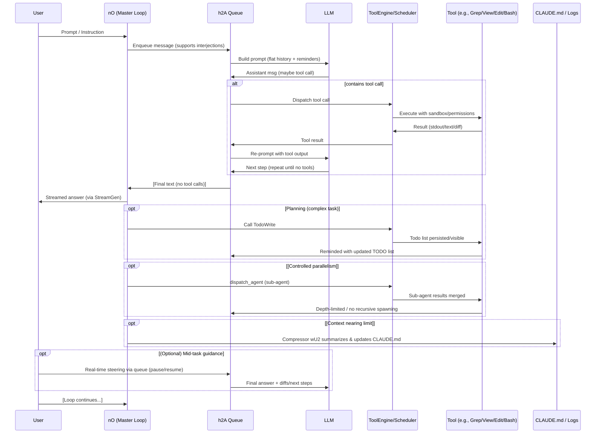

# Claude Code: Khám phá bên trong vòng lặp agent chính

Khi [Tom's Guide](https://www.tomsguide.com/ai/anthropic-is-putting-a-limit-on-a-claude-ai-feature-because-people-are-using-it-24-7?utm_source=openai) báo cáo rằng Anthropic đã phải thêm giới hạn hàng tuần sau khi người dùng chạy Claude Code 24/7, điều này đã tạo nên một cuộc xôn xao khá lớn. Claude Code đã làm điều gì đó đúng đắn. Hãy cùng tìm hiểu kiến trúc đằng sau hậu trường và xem liệu chúng ta có thể học được một vài điều về kỹ thuật agentic (hay [context engineering](https://blog.promptlayer.com/what-is-context-engineering/)?).

Cốt lõi của nó là một kiến trúc tưởng chừng đơn giản: một hệ thống phân lớp được xây dựng xung quanh một vòng lặp chính đơn luồng (có tên mã là **nO**), được tăng cường với khả năng điều khiển thời gian thực (hàng đợi **h2A**), một bộ công cụ phong phú dành cho developer, lập kế hoạch thông minh thông qua danh sách TODO, việc tạo ra sub-agent được kiểm soát, và các biện pháp an toàn toàn diện bao gồm quản lý bộ nhớ và quy trình làm việc dựa trên diff. Luận điểm rất đơn giản: một vòng lặp chính đơn luồng kết hợp với các công cụ và lập kế hoạch có kỷ luật sẽ mang lại tính tự chủ có thể kiểm soát. Một hệ thống mạnh mẽ được xây dựng trên nền tảng đơn giản.

## Kiến trúc tổng quan

Kiến trúc của Claude Code tuân theo thiết kế phân lớp rõ ràng, ưu tiên tính đơn giản và khả năng debug. Ở trên cùng là lớp tương tác người dùng - dù bạn đang sử dụng CLI, plugin VS Code, hay web UI, đây là nơi bạn giao tiếp với Claude. Bên dưới đó, lớp lập lịch cốt lõi agent chứa bộ não của hệ thống: engine vòng lặp agent chính (**nO**) hoạt động song song với một hàng đợi message bất đồng bộ (**h2A**) xử lý các sự kiện.

Các thành phần chính:
- **StreamGen** quản lý việc tạo output streaming
- **ToolEngine & Scheduler** điều phối các lời gọi tool và xếp hàng các truy vấn model
- **Compressor wU2** tự động kích hoạt khi sử dụng khoảng 92% context window để tóm tắt cuộc hội thoại và chuyển thông tin quan trọng vào bộ nhớ dài hạn. Bộ nhớ này được lưu trong một document Markdown đơn giản phục vụ như bộ nhớ dài hạn của dự án.

Luồng hoạt động rất đơn giản và tinh tế: input từ người dùng đến → model phân tích và quyết định hành động → nếu cần tools, chúng sẽ được gọi → kết quả được phản hồi lại model → chu kỳ tiếp tục cho đến khi có câu trả lời cuối cùng → quyền điều khiển trở lại cho người dùng.

Các nguyên tắc thiết kế cốt lõi của Claude Code:
Duy trì lịch sử message phẳng (không có threading phức tạp), và luôn "làm điều đơn giản trước" - chọn regex thay vì embeddings cho tìm kiếm, file Markdown thay vì database cho bộ nhớ.

## Vòng lặp agent chính (nO)

Trái tim của Claude Code đập theo nhịp của một vòng lặp agent cổ điển thể hiện sự đơn giản thông qua ràng buộc. Pattern cốt lõi cực kỳ tối giản: `while(tool_call) → execute tool → feed results → repeat`. Vòng lặp tiếp tục miễn là phản hồi của model bao gồm việc sử dụng tool; khi Claude tạo ra phản hồi văn bản thuần túy không có tool calls, vòng lặp tự nhiên kết thúc, chờ đợi input tiếp theo từ người dùng.

Thiết kế này duy trì một luồng chính duy nhất với một danh sách message phẳng - không có swarms, không có nhiều persona agent cạnh tranh để kiểm soát.

Anthropic đã chọn cách tiếp cận này một cách rõ ràng vì tính debuggability và độ tin cậy. Khi các vấn đề phức tạp phát sinh có thể hưởng lợi từ song song hóa, Claude Code cho phép tối đa một nhánh sub-agent tại một thời điểm, ngăn chặn sự hỗn loạn của việc tăng sinh agent không kiểm soát trong khi vẫn cho phép phân tách vấn đề tinh vi.

Một chuỗi thực thi điển hình có thể trông như thế này: Claude nhận được yêu cầu sửa lỗi → sử dụng Grep để tìm kiếm code liên quan → gọi View để đọc các file cụ thể → áp dụng Edit để sửa đổi code → chạy Bash để thực hiện test → công thức hóa câu trả lời cuối cùng. Mỗi bước được xây dựng logic dựa trên bước trước đó, tạo ra một audit trail minh bạch về lý luận và hành động của agent.

## Điều khiển thời gian thực với h2A

Điều làm cho hàng đợi dual-buffer bất đồng bộ **h2A** đặc biệt là hỗ trợ pause/resume và khả năng kết hợp các lời can thiệp của người dùng giữa task mà không cần khởi động lại hoàn toàn. Hãy tưởng tượng Claude Code đang làm việc thông qua một refactoring phức tạp khi bạn nhận ra rằng bạn cần thêm một ràng buộc hoặc chuyển hướng cách tiếp cận của nó. Thay vì dừng mọi thứ và bắt đầu lại, bạn có thể đơn giản chèn các hướng dẫn mới vào hàng đợi, và Claude sẽ điều chỉnh kế hoạch của mình một cách liền mạch.

Hàng đợi này hợp tác với **nO** để tạo ra các cuộc hội thoại streaming thực sự tương tác. Thay vì chờ đợi một completion khổng lồ, người dùng trải nghiệm một cuộc trao đổi động qua lại nơi họ có thể hướng dẫn, sửa chữa, hoặc tăng cường công việc của Claude trong thời gian thực. Chính tính tương tác này biến Claude Code từ một batch processor thành một đối tác coding thực thụ.

## Tools: bàn tay của agent

Các tools của Claude Code tuân theo một pattern giao diện nhất quán: các JSON tool calls chảy đến môi trường thực thi sandbox, trả về kết quả dưới dạng văn bản thuần túy. Sự đồng nhất này làm cho hệ thống có thể dự đoán và an toàn trong khi cung cấp cho Claude quyền truy cập vào bộ công cụ đầy đủ của developer.

Các công cụ đọc và khám phá tạo thành nền tảng. Những công cụ này cung cấp cho Claude đôi mắt trên codebase của bạn mà không làm quá tải nó với thông tin.

- **View tool** đọc các file (mặc định khoảng 2000 dòng)
- **LS** liệt kê nội dung thư mục  
- **Glob** thực hiện tìm kiếm wildcard trên ngay cả các repository khổng lồ.

Để tìm kiếm, Claude dựa vào **GrepTool** - một tiện ích tìm kiếm được hỗ trợ regex đầy đủ phản ánh khả năng của ripgrep. Đáng chú ý, Anthropic đã chọn regex thay vì vector databases hoặc embeddings. Claude đã hiểu cấu trúc code đủ sâu để tạo ra các regex pattern tinh vi, loại bỏ sự phức tạp và overhead của việc duy trì search indices.

Việc chỉnh sửa code xảy ra thông qua ba công cụ chính:
- **Edit** cho phép các patches và diffs phẫu thuật cho các thay đổi có mục tiêu
- **Write/Replace** xử lý các thao tác toàn bộ file hoặc tạo file mới

CLI hiển thị diffs tối thiểu để giữ output có thể đọc được, nhưng mọi thay đổi đều được theo dõi và có thể xem xét.

**Bash tool** cung cấp các phiên shell liên tục, hoàn chỉnh với phân loại mức độ rủi ro và lời nhắc xác nhận cho các lệnh nguy hiểm. Hệ thống chủ động lọc các nỗ lực injection (chặn backticks và cấu trúc `$()`) trong khi duy trì tính linh hoạt mà developers cần cho các thao tác hợp pháp.

Các công cụ chuyên biệt hoàn thiện bộ công cụ:
- **WebFetch** truy xuất URLs (hạn chế đối với URLs được người dùng đề cập hoặc trong dự án vì lý do bảo mật)
- **NotebookRead/Edit** xử lý Jupyter notebooks bằng cách phân tích cấu trúc JSON của chúng  
- **BatchTool** cho phép các thao tác được nhóm để hiệu quả. Mỗi công cụ được thiết kế với cả sức mạnh và an toàn trong tâm trí.

## Lập kế hoạch và song song hóa có kiểm soát

Khi đối mặt với các task nhiều bước, bước đầu tiên của Claude Code thường là gọi **TodoWrite**, tạo ra một danh sách task JSON có cấu trúc với IDs, nội dung, trạng thái, và mức độ ưu tiên. Đây không chỉ là bookkeeping nội bộ - UI render những cái này như các checklist tương tác, cung cấp cho người dùng khả năng nhìn thấy quy trình lập kế hoạch của Claude. Khi công việc tiến triển, Claude cập nhật toàn bộ danh sách (hệ thống không hỗ trợ cập nhật từng phần), đánh dấu các mục là "in_progress" hoặc "completed".

Chế độ lập kế hoạch `/think` cho phép người dùng yêu cầu một cách rõ ràng một kế hoạch trước khi bắt đầu thực thi.

Đằng sau hậu trường, hệ thống sử dụng reminders để giữ Claude tập trung: sau khi sử dụng tools, các system messages chèn trạng thái danh sách TODO hiện tại, ngăn model mất dấu các mục tiêu của nó trong các cuộc hội thoại dài.

Đối với các task yêu cầu khám phá hoặc các cách tiếp cận thay thế, Claude có thể gọi sub-agents thông qua công cụ **dispatch_agent** (nội bộ gọi là I2A/Task Agent). Những sub-agents này hoạt động với các giới hạn độ sâu - chúng không thể spawn sub-agents của riêng mình, ngăn chặn sự bùng nổ đệ quy. Các use cases phổ biến bao gồm tìm kiếm rộng trên codebase hoặc thử nhiều cách tiếp cận giải pháp song song. Kết quả từ sub-agents được đưa trở lại vòng lặp chính như các tool outputs thường xuyên, duy trì tính đơn giản đơn luồng của toàn bộ hệ thống.

## An toàn, bộ nhớ và tính minh bạch

Claude Code triển khai nhiều lớp bảo vệ thông qua hệ thống permission của nó. Các thao tác Write, lệnh Bash rủi ro, và việc sử dụng tool bên ngoài (MCP/web) đều yêu cầu các quyết định allow/deny rõ ràng. Người dùng có thể cấu hình whitelist hoặc các quy tắc always-allow cho các thao tác đáng tin cậy, cân bằng giữa bảo mật và hiệu quả workflow.

Command sanitization vượt ra ngoài việc lọc đơn giản. Hệ thống phân loại lệnh theo mức độ rủi ro và thêm các ghi chú an toàn vào tool outputs, nhắc nhở cả model và người dùng về các nguy hiểm tiềm tàng. Cách tiếp cận đa lớp này bắt được cả những sai lầm tình cờ và các vấn đề bảo mật tiềm tàng.

Quy trình làm việc diffs-first biến đổi cách các developer tương tác với code được tạo bởi AI. Các diffs màu sắc làm cho các thay đổi trở nên rõ ràng ngay lập tức, khuyến khích các sửa đổi tối thiểu và các chu kỳ review/revert dễ dàng. Cách tiếp cận này tự nhiên thúc đẩy test-driven development - Claude có thể chạy tests, thấy failures, và lặp lại trên các fixes, tất cả trong khi giữ các thay đổi minh bạch và được kiểm soát.

Để quản lý bộ nhớ và context, Claude Code sử dụng file **CLAUDE.md** như bộ nhớ dự án, được bổ sung bởi **Compressor wU2** tóm tắt các cuộc hội thoại khi tiếp cận giới hạn context. Tất cả tool calls và messages được ghi log, tạo ra một audit trail hoàn chỉnh về các hành động và quyết định của agent.

## Kết luận

Kiến trúc của Claude Code - vòng lặp master làm việc với h2A, bộ công cụ toàn diện, lập kế hoạch dựa trên TODO, sub-agents được kiểm soát, và các biện pháp an toàn mạnh mẽ - tạo ra một coding agent có thể kiểm soát, minh bạch, cân bằng sức mạnh với tính dự đoán được. Điểm mạnh của hệ thống không nằm ở các multi-agent swarms phức tạp mà ở thiết kế vòng lặp đơn giản của nó, làm một việc cực kỳ tốt: giúp developers viết code tốt hơn nhanh hơn.

Sức mạnh đến từ sự đơn giản triệt để của nó. Trong khi các đối thủ đuổi theo multi-agent swarms và orchestration phức tạp, Anthropic đã xây dựng một vòng lặp đơn luồng làm một việc một cách ám ảnh - think, act, observe, repeat. Cùng một pattern tạo sức mạnh cho một while loop CS101 bây giờ điều khiển một agent có khả năng refactor toàn bộ codebases. Kỹ thuật thanh lịch + thiết kế hướng-ràng buộc.